# EEG Characterizer HFO

This repo contains the High-Frequency Oscillations (HFO) detector from the Jacobs Lab at the University of Calgary. The detector spectral-based 

## Table of Contents

- [Overview](#overview)
- [Performance Metrics](#performance-metrics)
  - [Training Performance](#training-performance)
  - [Validation Performance](#validation-performance)
  - [Test Performance](#test-performance)
  - [Performance Summary](#performance-summary)
- [Features](#features)
- [Installation](#installation)
  - [Environment Setup](#environment-setup)
- [Usage](#usage)
  - [Quick Start](#quick-start)
  - [Command Line Arguments](#command-line-arguments)
  - [Example Usage](#example-usage)
- [Development](#development)
  - [MLflow Integration](#mlflow-integration)
- [Data Management](#data-management)
  - [Data Transfer to HPC](#data-transfer-to-hpc)
  - [File Management Commands](#file-management-commands)
- [HPC Cluster Usage](#hpc-cluster-usage)
  - [Connecting to ARC](#connecting-to-arc)
  - [Job Submission](#job-submission)
  - [Job Monitoring](#job-monitoring)
  - [Job Management](#job-management)
- [Project Structure](#project-structure)

## Overview

This tool provides automated detection and characterization of High-Frequency Oscillations (HFOs) in EEG data using spectral analysis. It supports various EEG formats and montage configurations for comprehensive neurophysiological analysis.

## Performance Metrics

Our XGBoost-based HFO detector demonstrates excellent performance across training, validation, and test datasets:

### AUC-PR Performance

```mermaid
xychart-beta
    title "AUC-PR Performance Comparison"
    x-axis ["Training (1.00)", "Validation (0.93)", "Test (0.94)"]
    y-axis "AUC-PR Score" 0.5 --> 1.0
    bar "Training (1.00)" [1.000, 0, 0]
    bar "Validation (0.93)" [0, 0.934, 0]
    bar "Test (0.94)" [0, 0, 0.935]
```


### Kappa Performance

```mermaid
xychart-beta
    title "Kappa Performance Comparison"
    x-axis ["Training (1.00)", "Validation (0.90)", "Test (0.90)"]
    y-axis "Kappa Score" 0.5 --> 1.0
    bar "Training (1.00)" [0.998, 0, 0]
    bar "Validation (0.90)" [0, 0.895, 0]
    bar "Test (0.90)" [0, 0, 0.895]
```


### Precision Performance


### Sensitivity Performance

```mermaid
xychart-beta
    title "Sensitivity Performance Comparison"
    x-axis ["Training (1.00)", "Validation (0.87)", "Test (0.87)"]
    y-axis "Sensitivity Score" 0.5 --> 1.0
    bar "Training (1.00)" [1.000, 0, 0]
    bar "Validation (0.87)" [0, 0.869, 0]
    bar "Test (0.87)" [0, 0, 0.871]
```


### Specificity Performance

```mermaid
xychart-beta
    title "Specificity Performance Comparison"
    x-axis ["Training (1.00)", "Validation (0.93)", "Test (0.94)"]
    y-axis "Specificity Score" 0.5 --> 1.0
    bar "Training (1.00)" [1.000, 0, 0]
    bar "Validation (0.93)" [0, 0.934, 0]
    bar "Test (0.94)" [0, 0, 0.935]
```


### Performance Summary

| Metric | Training | Validation | Test |
|--------|----------|------------|------|
| **AUC-PR** | 1.000 | 0.934 | 0.935 |
| **Kappa** | 0.998 | 0.895 | 0.895 |
| **Precision** | 0.997 | 0.924 | 0.923 |
| **Sensitivity** | 1.000 | 0.869 | 0.871 |
| **Specificity** | 1.000 | 0.934 | 0.935 |

The model shows very good generalization:
- **High Precision** (~92%): Low false positive rate
- **Good Sensitivity** (~87%): Effective HFO detection
- **High Specificity** (~93%): Accurate rejection of non-HFO events
- **Strong Kappa** (~90%): Excellent agreement beyond chance

## Features

- **Multi-format support**: EDF, BrainVision, and other common EEG formats
- **Flexible montage options**: Scalp bipolar (sb), scalp referential (sr), intracranial bipolar (ib), intracranial referential (ir)
- **Spectral analysis**: Advanced HFO detection using time-frequency analysis
- **Machine learning classification**: XGBoost-based HFO classification
- **Power line noise filtering**: Configurable notch filtering for different regions
- **Batch processing**: Process multiple files and datasets efficiently
- **MLflow integration**: Experiment tracking and model management

## Installation

### Environment Setup

This project uses UV for Python environment management. Follow these steps to set up the environment:

#### 1. Install uv from Astral
```bash
mkdir ~/tmp
cd ~/tmp
curl -LsSf https://astral.sh/uv/install.sh | sh
cd ~
```

#### 2. Clone the Repository
```bash
mkdir ~/Projects
cd ~/Projects
git clone https://github.com/Daniel-Lachner-Piza/EEG_Characterizer_HFO.git
cd EEG_Characterizer_HFO
```

#### 3. Install Dependencies
```bash
cd ~/Projects/EEG_Characterizer_HFO
uv sync
```

#### 4. Activate the Environment
```bash
cd ~/Projects/EEG_Characterizer_HFO
source .venv/bin/activate
```

## Usage

### Quick Start

Activate the environment and run the HFO detector:

```bash
# Navigate to detector's folder
cd ~/Projects/EEG_Characterizer_HFO

# Activate virtual environment
source .venv/bin/activate

# Run with basic parameters
python run_eeg_characterization.py --name MyAnalysis --inpath /path/to/eeg/data --outpath /path/to/output --format edf --montage sb --plf 60
```

#### ***The detector will batch process all the files in the --inpath directory that have the specified --format extension.***

### Command Line Arguments

- `--name`: Analysis name/identifier
- `--inpath`: Path to input EEG data directory
- `--outpath`: Path to output directory
- `--format`: EEG file format (edf, bv, etc.)
- `--montage`: Montage type (sb, sr, ib, ir)
- `--plf`: Power line frequency for notch filtering (50 or 60 Hz, anything else will deactivate notch filters)

### Example Usage

```bash
name=Test_DLP
inpath=/home/dlp/Documents/Development/Data/Physio_EEG_Data/
outpath=/home/dlp/Documents/Development/Data/Test-DLP-Output/
fmt=edf
montage=sb
plf=60

python run_eeg_characterization.py \
  --name $name \
  --inpath $inpath \
  --outpath $outpath \
  --format $fmt \
  --montage $montage \
  --plf $plf
```

## HPC Cluster Usage

This section covers running the HFO detection jobs on the ARC High-Performance Computing (HPC) cluster from the UofC, which uses SLURM as the workload manager.

### Connecting to ARC

Connect to the ARC cluster at University of Calgary:

```bash
ssh arc.ucalgary.ca
```

### Job Submission

### 1. Interactive jobs

#### 1.1 Request Computing Resources

Use `salloc` to request an interactive allocation of resources

```bash
# For memory-intensive tasks (64GB RAM, 80 cores, 3 hours)
salloc --mem=64G --partition=bigmem -c 80 -N 1 -n 1 -t 03:00:00

# For larger memory requirements (80GB RAM, 80 cores, 1 hour)
salloc --mem=80G --partition=bigmem -c 80 -N 1 -n 1 -t 01:00:00
```

**Resource allocation parameters:**
- `--mem`: Memory allocation (e.g., 64G, 80G)
- `--partition`: Queue partition (bigmem for large memory jobs)
- `-c`: Number of CPU cores
- `-N`: Number of nodes
- `-n`: Number of tasks
- `-t`: Time limit (HH:MM:SS format)

#### 1.2 Execute the HFO detection script:
```bash
# activate virtual environment
source .venv/bin/activate
# run detection script
python run_eeg_characterization.py --name MyAnalysis --inpath /path/to/eeg/data --outpath /path/to/output --format edf --montage sb --plf 60
```

### 2. Batch jobs

#### 2.1 For non-interactive jobs, create a SLURM batch script. Example `hfo_job.sh`:

```bash
#!/bin/bash

#SBATCH --job-name=frankfurt_clae_hfo_detection_job

####### Reserve computing resources #############
#SBATCH --mail-user=daniel.lachnerpiza@ucalgary.ca
#SBATCH --mail-type=ALL
#SBATCH --nodes=1
#SBATCH --ntasks=1
#SBATCH --cpus-per-task=40
#SBATCH --time=1-00:00:00
#SBATCH --mem=80G
#SBATCH --partition=bigmem

####### Set environment variables ###############
 . ~/Projects/EEG_Characterizer_HFO/activate.sh
echo $(which python)

####### Run your script #########################
dataset_name=PhysioTest
inpath=/work/jacobs_lab/EEG_Data/AnonymPhysioEEGs/
oupath=/work/jacobs_lab/Output/Output_${dataset_name}/
eegfmt=edf
mtg_name=sb
power_line_frequency=60
python ~/Projects/EEG_Characterizer_HFO/run_eeg_characterization.py \
  --input_folder "$inpath" \
  --dataset_name "$dataset_name" \
  --output_folder "$oupath" \
  --eeg_format "$eegfmt" \
  --montage_type "$mtg_name" \
  --power_line_freq "$power_line_frequency" \
```

#### 2.2 Loop through different folders containing the EEG files
```bash
#!/bin/bash

#SBATCH --job-name=frankfurt_clae_hfo_detection_job

####### Reserve computing resources #############
#SBATCH --mail-user=daniel.lachnerpiza@ucalgary.ca
#SBATCH --mail-type=ALL
#SBATCH --nodes=1
#SBATCH --ntasks=1
#SBATCH --cpus-per-task=40
#SBATCH --time=1-00:00:00
#SBATCH --mem=80G
#SBATCH --partition=bigmem

####### Set environment variables ###############
 . ~/Projects/EEG_Characterizer_HFO/activate.sh
echo $(which python)

####### Run your script #########################
dataset_name=PhysioTest
eegfmt=edf
mtg_name=sb
power_line_frequency=60

data_groups=(
    "HFOHealthy1monto2yrs" 
    "HFOHealthy3to5yrs" 
    "HFOHealthy6to10yrs" 
    "HFOHealthy11to13yrs" 
    "HFOHealthy14to17yrs"
)
for group in ${data_groups[@]}; do
  inpath="/work/jacobs_lab/EEG_Data/AnonymPhysioEEGs/${group}/"
  oupath="/work/jacobs_lab/Output/Output_${dataset_name}/${group}/"
  python ~/Projects/EEG_Characterizer_HFO/run_eeg_characterization.py \
    --dataset_name "$dataset_name" \
    --input_folder "$inpath" \
    --output_folder "$oupath" \
    --eeg_format "$eegfmt" \
    --montage_type "$mtg_name" \
    --power_line_freq "$power_line_frequency" \
done
```    

2.3 Submit the batch job:

```bash
sbatch hfo_job.sh
```

### Job Monitoring

#### Check Job Status

Monitor a specific job by its ID:

```bash
arc.job-info <job_id>
```

#### Continuous Monitoring

Monitor a job continuously with automatic updates every 2 seconds:

```bash
while sleep 2; do arc.job-info <job_id>; done
```

Example with specific job ID:
```bash
while sleep 2; do arc.job-info 35038925; done
```

#### View All Your Jobs

Check all jobs submitted by your user account:

```bash
squeue -u $USER
```

#### Job History

List all jobs from a specific date range:

```bash
sacct --starttime 2025-04-01 -u daniel.lachnerpiza
```

### Job Management

#### Cancel a Job

Stop a running or queued job:

```bash
scancel <job_id>
```

#### Check Job Efficiency

Analyze resource utilization after job completion:

```bash
seff <job_id>
```

This command provides information about:
- CPU efficiency
- Memory usage
- Job runtime
- Resource utilization statistics

## Project Structure

```
EEG_Characterizer_HFO/
├── hfo_spectral_detector/
│   ├── dsp/                    # Digital signal processing modules
│   ├── eeg_io/                 # EEG input/output handling
│   ├── elpi/                   # ELPI interface for annotations
│   ├── file_io/                # File handling utilities
│   ├── prediction/             # HFO classification models
│   ├── read_setup_eeg/         # EEG setup and montage creation
│   ├── spectral_analyzer/      # Spectral analysis components
│   └── studies_info/           # Study metadata management
├── hpc_jobs/                   # HPC job submission scripts
├── main.py                     # Main entry point
├── run_eeg_characterization.py # Command-line interface
├── pyproject.toml              # Project configuration
└── README.md                   # This file
```
