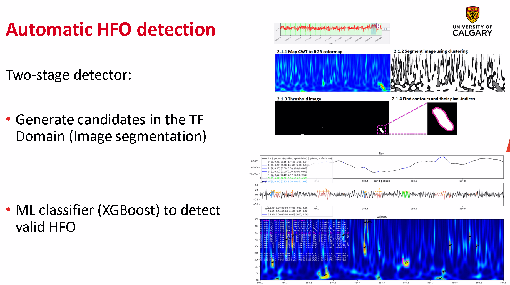

<center>



</center>


## Table of Contents

- [Overview](#overview)
- [Features](#features)
- [Methods](#methods)
- [Performance Metrics](#performance-metrics)
  - [AUC-PR Performance](#auc-pr-performance)
  - [Kappa Performance](#kappa-performance)
  - [Precision Performance](#precision-performance)
  - [Sensitivity Performance](#sensitivity-performance)
  - [Specificity Performance](#specificity-performance)
  - [Performance Summary](#performance-summary)
- [Installation](#installation)
  - [Environment Setup](#environment-setup)
    - [1. Install uv from Astral](#1-install-uv-from-astral)
    - [2. Clone the Repository](#2-clone-the-repository)
    - [3. Install Dependencies](#3-install-dependencies)
    - [4. Copy files for classifier model](#4-copy-files-for-classifier-model)
    - [Optional: Activate the Environment](#optional-activate-the-environment)
- [Usage](#usage)
  - [Quick Start](#quick-start)
  - [Command Line Arguments](#command-line-arguments)
  - [Example Usage](#example-usage)
- [HPC Cluster Usage](#hpc-cluster-usage)
  - [Connecting to ARC](#connecting-to-arc)
  - [Job Submission](#job-submission)
    - [1. Interactive jobs](#1-interactive-jobs)
    - [2. Batch jobs](#2-batch-jobs)
  - [Job Monitoring](#job-monitoring)
  - [Job Management](#job-management)
- [Project Structure](#project-structure)

## Overview

This tool provides automated detection and characterization of High-Frequency Oscillations (HFOs) in EEG data using spectral analysis. The montage generation for both Intracranial and Scalp EEG is done automatically and can be configured through the input arguments. It supports various EEG formats thanks to wrapper functions of [MNE Python](https://github.com/mne-tools/mne-python) readers.

## Features

- **Multi-format support**: EDF, BrainVision, and other common EEG formats
- **Flexible montage options**: Scalp bipolar (sb), scalp referential (sr), intracranial bipolar (ib), intracranial referential (ir)
- **Spectral analysis**: Advanced HFO detection using time-frequency analysis
- **Machine learning classification**: XGBoost-based HFO classification
- **Power line noise filtering**: Configurable notch filtering for different regions
- **Batch processing**: Process multiple files and datasets efficiently

## Methods

The XGBoost-based HFO detector was trained, validated and tested using a 11 patient Scalp EEG dataset coming from the Alberta Children's Hospital. Each EEG was recorded during N2 sleep and had an approximate duration of 10 minutes. The reference HFO in this Dataset were visually marked by Dr. Margarita Maltseva.
The events fed to the XGBoost classifier consisted of contours on the Wavelet based Spectrogram. These contours were detected in the following way:
- Apply Morlet CWT to the band-passed signal (80-500 Hz)
- Obtain the real part of the CWT and map it to RGB colors using matplotlib's [jet colormap](https://matplotlib.org/stable/users/explain/colors/colormaps.html)
- Segment the spectrogram by applying K-Means clustering to the RGB values
- Binarize the segmented image. The threshold for binarization was determined by the cluster containing the highest red value in its centroid.
- Once the image was binarized, contour objects were delimited using the [Topological structural analysis of digitized binary images by border following](https://www.sciencedirect.com/science/article/abs/pii/0734189X85900167) algorithm*.
- The horizontal and vertical limits of the contour objects provided time and frequency limits to calculate the [engineered features](docs/Engineered_Features_Description.md)

*\*Satoshi Suzuki and others. Topological structural analysis of digitized binary images by border following. Computer Vision, Graphics, and Image Processing, 30(1):32–46, 1985.*

## Performance Metrics
 The data was partitioned as follows: 50% Training-set, 30% Validation-set, 20% Test-set

### AUC-PR Performance

```mermaid
xychart-beta
    title "AUC-PR Performance Comparison"
    x-axis ["Training (1.00)", "Validation (0.93)", "Test (0.94)"]
    y-axis "AUC-PR Score" 0.5 --> 1.0
    bar "Training (1.00)" [1.000, 0, 0]
    bar "Validation (0.93)" [0, 0.934, 0]
    bar "Test (0.94)" [0, 0, 0.935]
```


### Kappa Performance

```mermaid
xychart-beta
    title "Kappa Performance Comparison"
    x-axis ["Training (1.00)", "Validation (0.90)", "Test (0.90)"]
    y-axis "Kappa Score" 0.5 --> 1.0
    bar "Training (1.00)" [0.998, 0, 0]
    bar "Validation (0.90)" [0, 0.895, 0]
    bar "Test (0.90)" [0, 0, 0.895]
```


### Precision Performance


### Sensitivity Performance

```mermaid
xychart-beta
    title "Sensitivity Performance Comparison"
    x-axis ["Training (1.00)", "Validation (0.87)", "Test (0.87)"]
    y-axis "Sensitivity Score" 0.5 --> 1.0
    bar "Training (1.00)" [1.000, 0, 0]
    bar "Validation (0.87)" [0, 0.869, 0]
    bar "Test (0.87)" [0, 0, 0.871]
```


### Specificity Performance

```mermaid
xychart-beta
    title "Specificity Performance Comparison"
    x-axis ["Training (1.00)", "Validation (0.93)", "Test (0.94)"]
    y-axis "Specificity Score" 0.5 --> 1.0
    bar "Training (1.00)" [1.000, 0, 0]
    bar "Validation (0.93)" [0, 0.934, 0]
    bar "Test (0.94)" [0, 0, 0.935]
```


### Performance Summary

| Metric | Training | Validation | Test |
|--------|----------|------------|------|
| **AUC-PR** | 1.000 | 0.934 | 0.935 |
| **Kappa** | 0.998 | 0.895 | 0.895 |
| **Precision** | 0.997 | 0.924 | 0.923 |
| **Sensitivity** | 1.000 | 0.869 | 0.871 |
| **Specificity** | 1.000 | 0.934 | 0.935 |

The model shows very good generalization:
- **High Precision** (~92%): Low false positive rate
- **Good Sensitivity** (~87%): Effective HFO detection
- **High Specificity** (~93%): Accurate rejection of non-HFO events
- **Strong Kappa** (~90%): Excellent agreement beyond chance
---

<br><br><br>

## Installation

### Environment Setup

This project uses UV for Python environment management. Follow these steps to set up the environment:

#### 1. Install uv from Astral
```bash
mkdir ~/tmp
cd ~/tmp
curl -LsSf https://astral.sh/uv/install.sh | sh
cd ~
```

#### 2. Clone the Repository
```bash
mkdir ~/Projects
cd ~/Projects
git clone https://github.com/Daniel-Lachner-Piza/EEG_Characterizer_HFO.git
cd EEG_Characterizer_HFO
```

#### 3. Install Dependencies
```bash
cd ~/Projects/EEG_Characterizer_HFO
uv sync
```

#### 4. Copy files for classifier model
```bash
cp /work/jacobs_lab/DetectorFiles/* ~/Projects/EEG_Characterizer_HFO/hfo
_spectral_detector/prediction/
```

or download files from GoogleDrive and transfer from local computer to ARC:
  https://drive.google.com/drive/folders/1yUeMmSEcIxKHiqPuXfkrhusDih5uNM5g?usp=drive_link
```bash
scp XGB_2025-09-08_23-42_Kappa90.json username@arc.ucalgary.ca:~/Projects/EEG_Characterizer_HFO/hfo_spectral_detector/prediction/
scp XGB_OptimalThreshold_2025-09-08_23-42_90.json username@arc.ucalgary.ca:~/Projects/EEG_Characterizer_HFO/hfo_spectral_detector/prediction/
scp XGB_Standard_Scaler_2025-09-08_23-42_Kappa90.bin username@arc.ucalgary.ca:~/Projects/EEG_Characterizer_HFO/hfo_spectral_detector/prediction/
```

#### Optional: Activate the Environment
```bash
cd ~/Projects/EEG_Characterizer_HFO
source .venv/bin/activate
```

## Usage

### Quick Start

Activate the environment and run the HFO detector:

```bash
# Navigate to detector's folder
cd ~/Projects/EEG_Characterizer_HFO

# Activate virtual environment
source .venv/bin/activate

# Basic example with minimal parameters
python run_eeg_hfo_characterize_detect.py --dataset_name MyAnalysis --input_folder /path/to/eeg/data --output_folder /path/to/output --montage_type sb

# Comprehensive example with all possible parameters
python run_eeg_hfo_characterize_detect.py \
    --dataset_name "ComprehensiveHFOAnalysis_2025" \
    --input_folder "/path/to/eeg/data" \
    --output_folder "/path/to/output/results" \
    --eeg_format "edf" \
    --montage_type "ib" \
    --montage_channels "F3-C3,C3-P3,F4-C4,C4-P4,Fp1-F3,Fp2-F4" \
    --rm_vchann "yes" \
    --power_line_freq 60 \
    --start_sec 30.0 \
    --end_sec 600.0 \
    --wdw_step_s 0.05 \
    --force_characterization "no" \
    --force_hfo_detection "yes" \
    --n_jobs 8 \
    --verbose "yes"
```

#### ***The detector will batch process all the files in the --input_folder directory that have the specified --eeg_format extension.***

### Command Line Arguments

#### Required Arguments
- `--dataset_name`: Analysis name/identifier
- `--input_folder`: Path to input EEG data directory
- `--output_folder`: Path to output directory
- `--montage_type`: Montage type (ib=intracranial bipolar, ir=intracranial referential, sb=scalp bipolar, sr=scalp referential)

#### Optional Arguments
- `--eeg_format`: EEG file format (edf, dat, vhdr) [default: edf]
- `--montage_channels`: Comma-separated specific channels to analyze (e.g., "F3-C3,C3-P3") [default: all channels]
- `--rm_vchann`: Remove Natus virtual channels (yes/no) [default: yes]
- `--power_line_freq`: Power line frequency for notch filtering (0=disabled, 50, 60) [default: 60]
- `--start_sec`: Analysis start time in seconds [default: 0]
- `--end_sec`: Analysis end time in seconds (-1=full length) [default: -1]
- `--wdw_step_s`: Window step size in seconds [default: 0.1]
- `--force_characterization`: Force recalculation of features (yes/no) [default: no]
- `--force_hfo_detection`: Force HFO detection (yes/no) [default: yes]
- `--n_jobs`: Number of parallel jobs (-1=all CPU cores) [default: -1]
- `--verbose`: Enable verbose output (yes/no) [default: yes]

A more detailed description of the inout arguments can be found [here](docs/run_eeg_hfo_characterize_detect_usage.md)
---

<br><br><br>

## HPC Cluster Usage

This section covers running the HFO detection jobs on the ARC High-Performance Computing (HPC) cluster from the UofC, which uses SLURM as the workload manager.

### Connecting to ARC

Connect to the ARC cluster at University of Calgary:

```bash
ssh arc.ucalgary.ca
```

### Job Submission

### 1. Interactive jobs

#### 1.1 Request Computing Resources

Use `salloc` to request an interactive allocation of resources

```bash
# For memory-intensive tasks (64GB RAM, 80 cores, 3 hours)
salloc --mem=64G --partition=bigmem -c 80 -N 1 -n 1 -t 03:00:00

# For larger memory requirements (80GB RAM, 80 cores, 1 hour)
salloc --mem=80G --partition=bigmem -c 80 -N 1 -n 1 -t 01:00:00
```

**Resource allocation parameters:**
- `--mem`: Memory allocation (e.g., 64G, 80G)
- `--partition`: Queue partition (bigmem for large memory jobs)
- `-c`: Number of CPU cores
- `-N`: Number of nodes
- `-n`: Number of tasks
- `-t`: Time limit (HH:MM:SS format)

#### 1.2 Execute the HFO detection script:
```bash
# activate virtual environment
source .venv/bin/activate
# run detection script
python run_eeg_characterization.py --name MyAnalysis --inpath /path/to/eeg/data --outpath /path/to/output --format edf --montage sb --plf 60
```

### 2. Batch jobs

#### 2.1 For non-interactive jobs, create a SLURM batch script. Example `hfo_job.sh`:

```bash
#!/bin/bash

#SBATCH --job-name=frankfurt_clae_hfo_detection_job

####### Reserve computing resources #############
#SBATCH --mail-user=daniel.lachnerpiza@ucalgary.ca
#SBATCH --mail-type=ALL
#SBATCH --nodes=1
#SBATCH --ntasks=1
#SBATCH --cpus-per-task=40
#SBATCH --time=1-00:00:00
#SBATCH --mem=80G
#SBATCH --partition=bigmem

####### Set environment variables ###############
 . ~/Projects/EEG_Characterizer_HFO/activate.sh
echo $(which python)

####### Run your script #########################
dataset_name=PhysioTest
inpath=/work/jacobs_lab/EEG_Data/AnonymPhysioEEGs/
oupath=/work/jacobs_lab/Output/Output_${dataset_name}/
eegfmt=edf
mtg_name=sb
power_line_frequency=60
python ~/Projects/EEG_Characterizer_HFO/run_eeg_characterization.py \
  --input_folder "$inpath" \
  --dataset_name "$dataset_name" \
  --output_folder "$oupath" \
  --eeg_format "$eegfmt" \
  --montage_type "$mtg_name" \
  --power_line_freq "$power_line_frequency" \
```

#### 2.2 Loop through different folders containing the EEG files
```bash
#!/bin/bash

#SBATCH --job-name=frankfurt_clae_hfo_detection_job

####### Reserve computing resources #############
#SBATCH --mail-user=daniel.lachnerpiza@ucalgary.ca
#SBATCH --mail-type=ALL
#SBATCH --nodes=1
#SBATCH --ntasks=1
#SBATCH --cpus-per-task=40
#SBATCH --time=1-00:00:00
#SBATCH --mem=80G
#SBATCH --partition=bigmem

####### Set environment variables ###############
 . ~/Projects/EEG_Characterizer_HFO/activate.sh
echo $(which python)

####### Run your script #########################
dataset_name=PhysioTest
eegfmt=edf
mtg_name=sb
power_line_frequency=60

data_groups=(
    "HFOHealthy1monto2yrs" 
    "HFOHealthy3to5yrs" 
    "HFOHealthy6to10yrs" 
    "HFOHealthy11to13yrs" 
    "HFOHealthy14to17yrs"
)
for group in ${data_groups[@]}; do
  inpath="/work/jacobs_lab/EEG_Data/AnonymPhysioEEGs/${group}/"
  oupath="/work/jacobs_lab/Output/Output_${dataset_name}/${group}/"
  python ~/Projects/EEG_Characterizer_HFO/run_eeg_characterization.py \
    --dataset_name "$dataset_name" \
    --input_folder "$inpath" \
    --output_folder "$oupath" \
    --eeg_format "$eegfmt" \
    --montage_type "$mtg_name" \
    --power_line_freq "$power_line_frequency" \
done
```    

2.3 Submit the batch job:

```bash
sbatch hfo_job.sh
```

### Job Monitoring

#### View All Your Jobs

Check all jobs submitted by your user account:

```bash
squeue -u $USER
```

#### Check Job Status

Monitor a specific job by its ID:

```bash
arc.job-info <job_id>
```

#### Continuous Monitoring

Monitor a job continuously with automatic updates every 2 seconds:

```bash
while sleep 2; do arc.job-info <job_id>; done
```

Example with specific job ID:
```bash
while sleep 2; do arc.job-info 35038925; done
```

#### Job History

List all jobs from a specific date range:

```bash
sacct --starttime 2025-04-01 -u daniel.lachnerpiza
```

### Job Management

#### Cancel a Job

Stop a running or queued job:

```bash
scancel <job_id>
```

#### Check Job Efficiency

Analyze resource utilization after job completion:

```bash
seff <job_id>
```

This command provides information about:
- CPU efficiency
- Memory usage
- Job runtime
- Resource utilization statistics
---

<br><br><br>

## Troubleshooting

### Common Issues

**1. Sampling Rate Error**
```
Error: Sampling Rate is XXX Hz, which is under 1000 Hz!
```
*Solution*: HFO analysis requires sampling rates > 1000 Hz. Use higher sampling rate recordings.

**2. No Files Found**
```
Warning: No edf files found in /path/to/folder
```
*Solution*: Check file format parameter matches actual files, verify folder path.

**3. Memory Issues**
```
Error: Out of memory during processing
```
*Solution*: Reduce `n_jobs` parameter or process fewer files simultaneously.

**4. Channel Configuration Error**
```
Error: Invalid montage type
```
*Solution*: Use valid montage types: 'ib', 'ir', 'sb', 'sr'.

### Debugging Tips
- Use `--verbose "yes"` for detailed output
- Check log files in the `logs/` directory
- Verify file permissions for input/output directories

## Performance Considerations

### Optimization Strategies
- **CPU cores**: Use `-1` for automatic detection, or specify optimal number
- **Window step size**: Larger steps = faster processing, less overlap
- **Time ranges**: Process specific time segments for faster analysis

---

<br><br><br>

## Project Structure

```
EEG_Characterizer_HFO/
├── hfo_spectral_detector/
│   ├── dsp/                    # Digital signal processing modules
│   ├── eeg_io/                 # EEG input/output handling
│   ├── elpi/                   # ELPI interface for annotations
│   ├── file_io/                # File handling utilities
│   ├── prediction/             # HFO classification models
│   ├── read_setup_eeg/         # EEG setup and montage creation
│   ├── spectral_analyzer/      # Spectral analysis components
│   └── studies_info/           # Study metadata management
├── hpc_jobs/                   # HPC job submission scripts
├── main.py                     # Main entry point
├── run_eeg_characterization.py # Command-line interface
├── pyproject.toml              # Project configuration
└── README.md                   # This file
```

---

## Repository Statistics


&query=count&url=https://github-clone-count-badge.herokuapp.com/Daniel-Lachner-Piza/EEG_Characterizer_HFO&logo=github)


